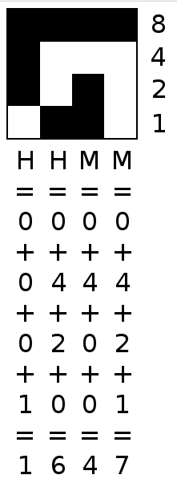

# Bitclock
[Bitclock](https://lucidmachine.github.io/bitclock/) is a clock made of binary integers to help you practice reading binary.

# Reading
<pre>
For each digit from left to right compute the sum:
    For each value place from top to bottom, 8 to 1:
        If the bit is on then add that value to the sum.
</pre>


# Architecture
## Data Structures
### BitDigit
A BitDigit is an array of 4 bits which represents a single digit. Positions in the array signify place values 8, 4, 2, and 1. The value stored in that position may be either a 0 or a 1. If the value is a 1, then the corresponding place value should be added to the sum. If the value is a 0, then the corresponding place value is ignored.
```
// 8  4  2  1
  [1, 0, 0, 1]  // 8 + 0 + 0 + 1 = 9
  [0, 1, 1, 0]  // 0 + 4 + 2 + 0 = 6

```

### BitTime
A BitTime is an array of BitDigits. Each item is a digit in the current time read left to right.
```
// 12:34:56
[
// 8  4  2  1
  [0, 0, 0, 1],  // H1: 0 + 0 + 0 + 1 = 1
  [0, 0, 1, 0],  // H2: 0 + 0 + 2 + 0 = 2
  [0, 0, 1, 1],  // M1: 0 + 0 + 2 + 1 = 3
  [0, 1, 0, 0],  // M2: 0 + 1 + 0 + 0 = 4
  [0, 1, 0, 1],  // S1: 0 + 1 + 0 + 1 = 5
  [0, 1, 1, 0]   // S2: 0 + 1 + 1 + 0 = 6
]
```


## Backend
Backends retrieve the current time and transform it into a BitTime.

## Frontend
Frontends transform a BitTime into something an end user can interpret. Reference implementations exist to draw pixels in a web page or favicon, but ambitious hackers could write to a visual CLI, LEDs, audio, or even a braille terminal.